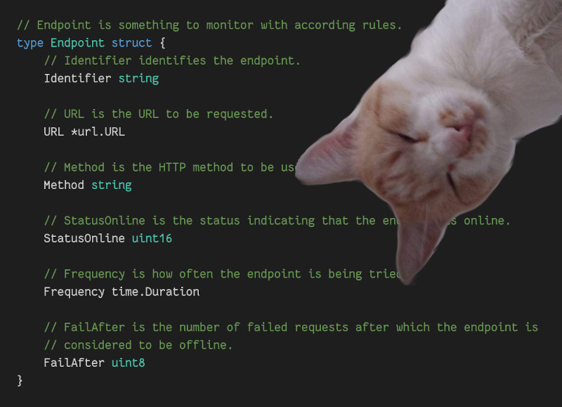

# meow: Monitor Endpoints on (the) Web

meow is a simple monitoring system for unauthenticated HTTP endpoints.



meow consists of the following components:

1. A configuration server to manage the endpoints to be monitored.
2. The actual monitoring daemon performing the requests.
3. A server offering a canary endpoint for local testing.

## Configuration Server (`configCmd/config.go`)

Run it with an existing configuration CSV file (to be overwritten):

    $ go run configCmd/config.go -file sample.cfg.csv

A configuration defines multiple endpoints, each consisting of the following
indications:

1. Identifier: A (short) identifier string (matching regexp `^[a-z][-a-z0-9]+$`)
2. URL: The URL of the endpoint to be monitored.
3. Method: The HTTP method to be used for the request (e.g. `GET`, `HEAD`).
4. StatusOnline: Response HTTP status code indicating success (e.g. `200`).
5. Frequency: How often the request should be performed (e.g. `1m30s`).
6. FailAfter: After how many failing requests the endpoint is considered offline.

Get an endpoint by its identifier:

```bash
$ curl -X GET localhost:8000/endpoints/libvirt
{"identifier":"libvirt","url":"https://libvirt.org/","method":"GET","status_online":200,"frequency":"1m0s","fail_after":5}
```

Get all endpoints:

```bash
$ curl -X GET localhost:8000/endpoints
[{"identifier":"go-dev","url":"https://go.dev/doc/","method":"HEAD","status_online":200,"frequency":"5m0s","fail_after":1},{"identifier":"libvirt","url":"https://libvirt.org/","method":"GET","status_online":200,"frequency":"1m0s","fail_after":5},{"identifier":"frickelbude","url":"https://code.frickelbude.ch/api/v1/version","method":"GET","status_online":200,"frequency":"1m0s","fail_after":3}]
```

Post an endpoint using a JSON payload:

```bash
$ curl -X POST localhost:8000/endpoints/hackernews -d @endpoint.json
```

With `endpoint.json` defined as:

```json
{
    "identifier": "hackernews",
    "url": "https://news.ycombinator.com/",
    "method": "GET",
    "status_online": 200,
    "frequency": "1m",
    "fail_after": 5
}
```

## Probe (`probeCmd/probe.go`)

The probe daemon requires a running config server, whose URL needs to be passed
as an environment variable:

    $ CONFIG_URL=http://localhost:8000 go run probeCmd/probe.go

The probe fetches the endpoints currently configured and probes them
periodically. The results of the probes are written both onto the terminal
(`stderr`), and to a logfile in the temporary directory, e.g.:

    started logging to /tmp/meow-2022-11-20T17-00-32.log
    started probing go-dev every 30s
    started probing frickelbude every 10
    😿 local-canary is not online (1 times)
    🐱 frickelbude is online (took 82.440665ms)
    🐱 go-dev is online (took 254.07882ms)

## Canary

The canary server provides a single endpoint (`/canary`) for local testing:

    $ go run canaryCmd/canary.go
    listen to 0.0.0.0:9000

Both bind address and port can be configured:

    $ go run canaryCmd/canary.go -bind localhost -port 9999
    listen to localhost:9999

The endpoint can be tested using `curl`:

    $ curl -X GET localhost:9999/canary
    OK
